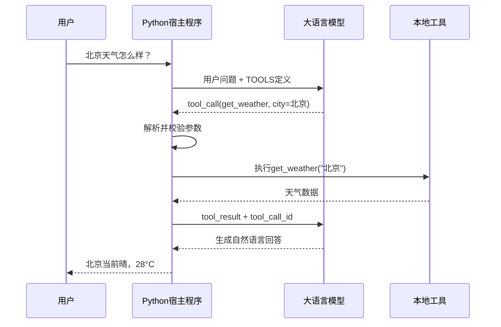

# Tool Calling Demo

这是 AI Engineering 两周速通计划 Day 11 的实践项目，对应 Phase 13：Tools and Protocols。

项目目标是理解并实现完整的工具调用流程：大语言模型负责选择工具和生成参数，Python 宿主程序负责校验参数、执行函数，再把执行结果交回模型生成最终回答。

```text
Describe -> Decide -> Execute -> Observe
```

## 项目功能

本项目提供三个工具：

| 工具 | 功能 | 类型 |
|---|---|---|
| `get_current_time` | 查询当前本地时间和时区 | 纯工具 |
| `get_weather` | 查询本地模拟天气数据 | 纯工具 |
| `calculate` | 安全计算基础数学表达式 | 纯工具 |

程序还实现了：

- OpenAI-compatible API 原生 Tool Calling
- JSON Schema 工具参数描述
- 工具名称到 Python 函数的映射
- 参数 JSON 解析
- 未知工具和执行异常处理
- 通过 `tool_call_id` 返回工具结果
- 最多 5 轮工具调用，避免死循环
- 不使用危险 `eval()` 的安全计算器

## 项目目录

```text
my-projects/
└── tool-calling-demo/
    ├── main.py
    ├── README.md
    └── requirements.txt
```

## 工作原理



四个阶段分别是：

1. **Describe**：程序通过 `TOOLS` 向模型说明工具名称、用途和参数。
2. **Decide**：模型判断是否使用工具，并返回 `tool_calls`。
3. **Execute**：程序解析参数并执行对应的 Python 函数。
4. **Observe**：程序将结果作为 `tool` 消息交回模型，模型生成最终回答。

模型不会亲自运行 Python。模型只负责提出调用请求，真正执行工具的是宿主程序。

## 环境准备

进入项目根目录：

```powershell
cd D:\ai-engineering\ai-engineering-from-scratch
```

激活虚拟环境：

```powershell
D:\ai-engineering\.venv\Scripts\Activate.ps1
```

成功后终端开头应出现：

```text
(.venv) PS D:\ai-engineering\ai-engineering-from-scratch>
```

安装依赖：

```powershell
python -m pip install openai
```

## 使用 DeepSeek API

先在 DeepSeek 平台创建 API Key，然后设置环境变量：

```powershell
$env:OPENAI_API_KEY="你的真实DeepSeek API Key"
$env:OPENAI_BASE_URL="https://api.deepseek.com"
$env:OPENAI_MODEL="deepseek-v4-pro"
```

注意：

- `OPENAI_API_KEY` 必须是真实 Key，不能填写中文占位符。
- `https://platform.deepseek.com/api_keys` 是管理 Key 的网页，不是 API 地址。
- OpenAI-compatible API 地址应为 `https://api.deepseek.com`。

运行项目：

```powershell
python .\my-projects\tool-calling-demo\main.py
```

也可以指定 Python 解释器：

```powershell
& D:\ai-engineering\.venv\Scripts\python.exe `
  D:\ai-engineering\ai-engineering-from-scratch\my-projects\tool-calling-demo\main.py
```

## 测试问题

```text
现在几点？
北京天气怎么样？
计算 (18 + 2) * 5
计算 10 / 0
```

正常工具调用应出现类似输出：

```text
[Decide 第1轮]
工具：get_current_time
参数：{}

[Execute]
结果：{"ok": true, "data": {...}}

AI：当前时间是……
```

除零测试应返回结构化错误，而不是让整个程序崩溃：

```text
[Execute]
结果：{"ok": false, "error": "不能除以0"}

AI：计算失败，因为除数不能为0。
```

## 主要代码结构

### 工具函数

`get_current_time()`、`get_weather()` 和 `calculate()` 是普通 Python 函数，负责真正执行工作。

### TOOLS

`TOOLS` 是交给模型阅读的工具说明书。每个工具包含：

```text
名称 + 描述 + 输入JSON Schema
```

模型根据名称和描述决定调用哪个工具，再按照 Schema 生成参数。

### TOOL_FUNCTIONS

工具映射表把模型返回的字符串名称映射到真实函数：

```python
TOOL_FUNCTIONS = {
    "get_current_time": get_current_time,
    "get_weather": get_weather,
    "calculate": calculate,
}
```

### execute_tool()

该函数负责：

- 检查工具是否存在
- 调用对应 Python 函数
- 捕获参数、语法、除零和其他执行错误
- 返回统一的 `{ok, data}` 或 `{ok, error}` 结构

### handle_user_message()

这是工具调用循环的核心：

```text
调用模型
-> 检查tool_calls
-> 解析arguments
-> 执行工具
-> 使用tool_call_id回传结果
-> 再次调用模型
-> 输出最终答案
```

循环最多执行 5 轮，防止模型不断调用工具造成费用和时间失控。

## 为什么计算器不能直接使用 eval()

下面的写法不安全：

```python
result = eval(expression)
```

恶意输入可能借此执行任意 Python 代码。本项目通过 `ast` 解析表达式，只允许：

- 数字
- 括号
- `+ - * / // % **`
- 正号和负号

其他语法会被拒绝。

## 今日运行过的 MCP Server Demo

在编写本项目之前，运行了 Phase 13 Lesson 07 的 MCP Server：

```powershell
python main.py --demo
```

该演示依次完成：

```text
initialize
-> tools/list
-> tools/call
-> resources/list
-> resources/read
-> tools/call（创建笔记）
-> prompts/get
-> 调用未知工具并返回isError=true
```

它验证了 MCP Server 的能力协商、工具、资源、提示词和错误处理。直接运行 `python main.py` 时程序没有输出，是因为 stdio MCP Server 正在等待 Client 发送 JSON-RPC 消息；添加 `--demo` 才会运行内置测试流程。

## 今日遇到的问题

### 1. 虚拟环境无法激活

错误命令：

```powershell
D:\ai-engineering\.venv\Scripts\activate
```

PowerShell 正确命令通常是：

```powershell
D:\ai-engineering\.venv\Scripts\Activate.ps1
```

如果 `Activate.ps1` 已丢失，说明虚拟环境残缺，应使用 Python 3.12 重新创建，不能只从网上下载一个脚本。

### 2. ASCII 编码错误

错误：

```text
'ascii' codec can't encode characters
```

原因是把中文占位符直接当作 API Key：

```powershell
$env:OPENAI_API_KEY="你的API Key"
```

HTTP Authorization 请求头只能使用可编码字符。解决方法是替换成真实 API Key。

### 3. Qwen 返回伪工具调用

使用 `Qwen/Qwen2.5-7B-Instruct` 时，模型返回了类似：

```text
{"get_current_time" "arguments": {}}}}
```

这只是普通文本，不是 SDK 中真正的 `message.tool_calls`，而且不是合法 JSON。说明该模型或当前网关对原生 Tool Calling 支持不稳定。

解决方法：

- 使用明确支持原生 Tool Calling 的模型
- 不要依赖提示词让模型模仿 JSON
- 测试时可以暂时把 `tool_choice="auto"` 改成 `tool_choice="required"`

### 4. 请求一直没有返回

最终出现：

```text
KeyboardInterrupt
```

这表示程序正在等待网络响应，随后用户按了 `Ctrl + C`，并不是计算器本身报错。

建议为客户端增加超时：

```python
client = OpenAI(
    api_key=api_key,
    base_url=base_url,
    timeout=30.0,
    max_retries=1,
)
```

### 5. DeepSeek 返回405

错误配置：

```powershell
$env:OPENAI_BASE_URL="https://platform.deepseek.com/api_keys"
```

这是网页地址，SDK 对它发送 POST 请求会返回：

```text
405 Method Not Allowed
```

正确配置：

```powershell
$env:OPENAI_BASE_URL="https://api.deepseek.com"
$env:OPENAI_MODEL="deepseek-v4-pro"
```

## 安全与工程思考

本项目中的三个工具都是纯工具，没有修改外部状态。真实项目还可能存在：

- 发送邮件
- 删除文件
- 提交订单
- 执行交易

这些有副作用的工具必须增加用户确认、身份验证、权限检查和审计日志。

JSON Schema 只能保证参数格式正确，不能证明用户有权执行操作。

## 我学到了什么

- LLM 只能提出工具调用请求，不能亲自执行 Python
- 工具由名称、描述、参数 Schema 和执行函数组成
- `tool_call_id` 用于关联调用和工具结果
- Tool Calling 的核心是 Describe、Decide、Execute、Observe
- MCP 将工具发现和调用标准化到 Client 与 Server 之间
- Tool、Resource 和 Prompt 是不同类型的 MCP Server 原语
- 工具调用必须有异常处理、超时、最大重试和最大循环次数
- API Key 管理网页与 API Base URL 不是同一个地址
- 能输出类似 JSON 的文本，不等于支持原生 Tool Calling

## 后续改进

- 接入真实天气 API
- 使用 Pydantic 完成更严格的参数校验
- 增加工具执行耗时统计和日志
- 支持并行工具调用
- 为高风险工具增加用户确认
- 将三个本地工具封装成 MCP Server
- 为项目增加自动化测试

## 参考资料

- [Phase 13：Tools and Protocols](https://github.com/407551152-svg/ai-engineering-from-scratch/tree/main/phases/13-tools-and-protocols)
- [DeepSeek Tool Calls](https://api-docs.deepseek.com/guides/tool_calls)
- [Model Context Protocol](https://modelcontextprotocol.io/)
